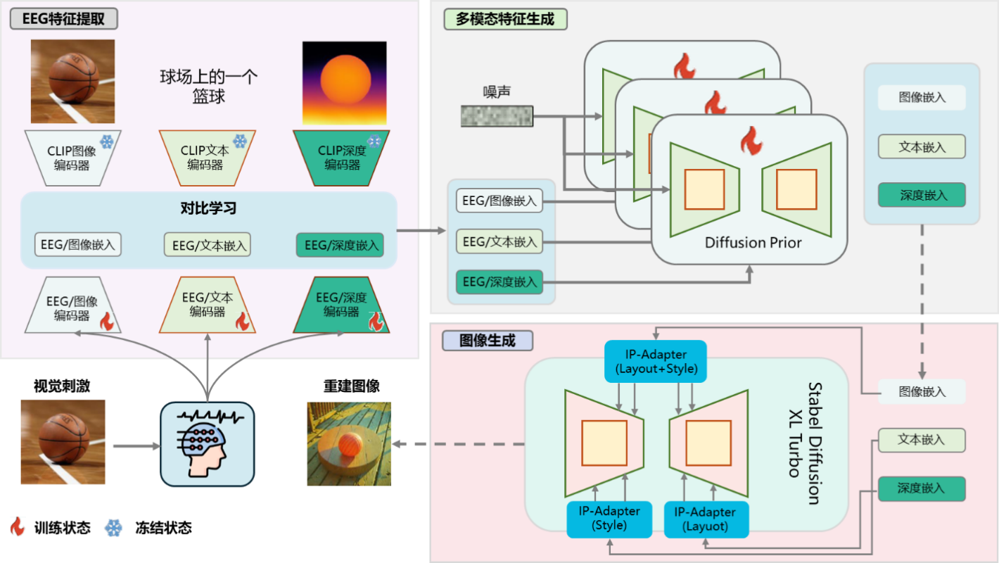
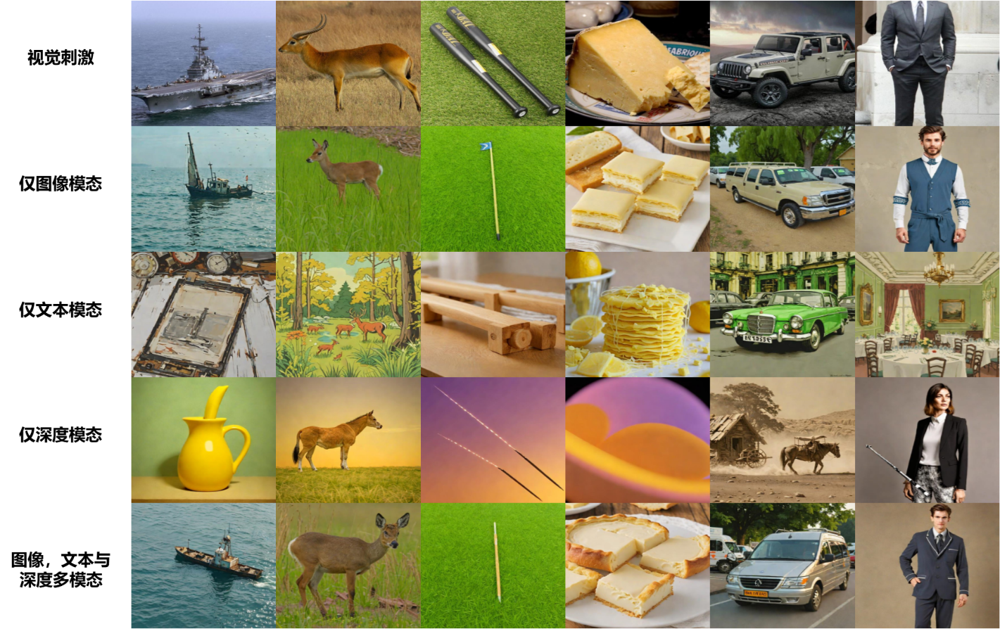

# CognitionCapturer - Graduation Project

This repository contains the refactored and improved implementation of CognitionCapturer for my graduation project, a multimodal EEG-based visual reconstruction system that uses diffusion models to decode and reconstruct visual images from human brain signals. The implementation is originally based on the AAAI 2025 paper: ["CognitionCapturer: Decoding Visual Stimuli from Human EEG Signals with Multimodal Information"](https://arxiv.org/pdf/2412.10489).

## Project Overview

This graduation project builds upon the original CognitionCapturer framework, with significant contributions focused on:
- **Code Organization**: Restructured and cleaned up the codebase for better maintainability
- **Logic Streamlining**: Identified and resolved logical inconsistencies in the original implementation
- **Functionality Restoration**: Made the entire pipeline runnable and reproducible
- **Documentation Enhancement**: Improved code documentation and usage instructions

<p align="center">
  <a href="#">
  <p align="center">
    <a href='https://arxiv.org/pdf/2412.10489'></a>
  </p>
</p>


  
 

## My Contributions

### 1. Code Refactoring and Organization
- Reorganized the entire codebase structure for better modularity
- Separated concerns between different components (data processing, model training, evaluation)
- Improved error handling and logging throughout the pipeline

### 2. Logic Streamlining
- Identified and fixed logical inconsistencies in the original training pipeline
- Streamlined the data loading and preprocessing workflows
- Resolved dependency conflicts and version compatibility issues

### 3. Functionality Restoration
- Made the complete training and inference pipeline functional
- Fixed broken scripts and missing dependencies
- Ensured reproducible results across different environments

### 4. Enhanced Documentation
- Added comprehensive inline code documentation
- Improved README with clearer setup and usage instructions
- Created troubleshooting guides for common issues

## Improved Code Structure

```
File path | Description | Improvements Made

/configs
┣ 📂 experiment
┃   ┗ 📜 brainencoder_all.yaml          | ✅ Fixed parameter conflicts and added validation
┃   ┗ 📜 brainencoder_single.yaml       | ✅ Streamlined configuration structure

┣ 📂 paths  
┃   ┗ 📜 pathsSelf.yaml                 | ✅ Added automatic path validation

/src
┣ 📂 data
┃   ┗ 📜 THINGSEEG_datamodule.py        | ✅ Improved data loading efficiency and error handling
┃   ┣ 📂 utils
┃   ┃   ┗ (Processing scripts)          | ✅ Optimized depth map and text generation workflows

┣ 📂 models
┃   ┗ 📜 Cogcap_single_module.py        | ✅ Refactored model architecture for clarity
┃   ┗ 📜 Cogcap_allmodality_module.py   | ✅ Fixed multimodal fusion logic
┃   ┣ 📂 components
┃   ┃   ┗ (Model components)            | ✅ Modularized loss functions and evaluation metrics

┣ 📂 Scripts
┃   ┣ 📂 train_align
┃   ┃   ┗ (Diffusion Prior training)    | ✅ Fixed training instability issues
┃   ┣ 📂 generation
┃   ┃   ┗ (Image generation)            | ✅ Improved generation pipeline reliability
```

## Environment Setup

Install the required dependencies by running:

```bash
conda env create -f environment.yaml
conda activate BCI
```

**Note**: I've updated the environment file to resolve version conflicts and ensure compatibility across different systems.

## Dataset and Model Weights

Dataset follows the Data availability Section of the original [EEG_Image_decode](https://github.com/dongyangli-del/EEG_Image_decode) repository. Please follow their README to download the EEG dataset.

**Pre-trained Models Used**:
- SDXL-Turbo: https://huggingface.co/stabilityai/sdxl-turbo
- IP-Adapter: https://huggingface.co/h94/IP-Adapter
- Open CLIP ViT-H/14: https://github.com/mlfoundations/open_clip
- DepthAnything: https://github.com/LiheYoung/Depth-Anything
- BLIP2: https://huggingface.co/docs/transformers/main/model_doc/blip-2

## Usage Instructions

### Setup
1. Download the required datasets and pretrained models
2. Update paths in `configs/paths/pathsSelf.yaml` to match your system
3. Verify environment setup with: `python src/utils/check_setup.py`

### Training Pipeline

#### 1. Classification Training
```bash
python src/train.py experiment=brainencoder_all.yaml
```

#### 2. Diffusion Prior Alignment
```bash
python src/Scripts/train_align/main.py
```

#### 3. Image Generation
```bash
python src/Scripts/generation/multiadapter/ip_adapter_testing.py
```

## Acknowledgements

### Original Work
This project is based on the outstanding work of:
- [CognitionCapturer](https://github.com/XiaoZhangYES/CognitionCapturer)
- [EEG_Image_decode](https://github.com/dongyangli-del/EEG_Image_decode)
- [lightning-hydra-template](https://github.com/ashleve/lightning-hydra-template)
- [NICE-EEG](https://github.com/eeyhsong/NICE-EEG)

### Dataset
Original dataset available at: https://www.sciencedirect.com/science/article/pii/S1053811922008758?via%3Dihub

Special thanks to Dr. Jili Xia for her contributions to the original work.


